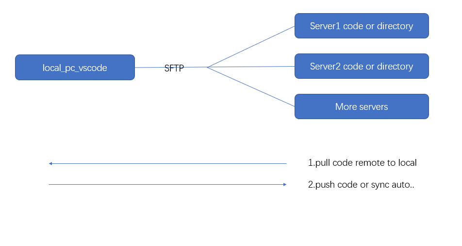

### Why Choose Vscode
```
If you code in test server and need view hundred of lines code, 
maybe it's not easy to use vim to review or search keyword. I used to pycharm for python,
pycharm is a good ide for python. Well, as you know,
professional pycharm need to pay and it consumes the massive resources by itself. 
It Running on macbook, laptop fan make a lot of noise. So i choose the vscode, 
vscode have good optimization in win10 and mac, contains rich extensions too.
```


### Better plugin in vscode

1.  [Vscode SFTP][1]  
```
>* when to use
1.Writting large yml files or hundred of lines code, testing in remote server immediately.
2.Sync automatically both from remote special directory or files to local's after rewritting.
```


```
After installed, it will get sftp.json, you could check my sftp.json to configuration yours.
context: pc local directory
remotePath: remote server's directory
syscOption: 
  delete:{true} 
  - you could delete in one side, and don't need to delete the other side by hand.
  
  update:{false}
  - some important settings, you don't want to change one side and the other side sync immediately.
    you could control this by hand.
```


[1]: https://github.com/liximomo/vscode-sftp

